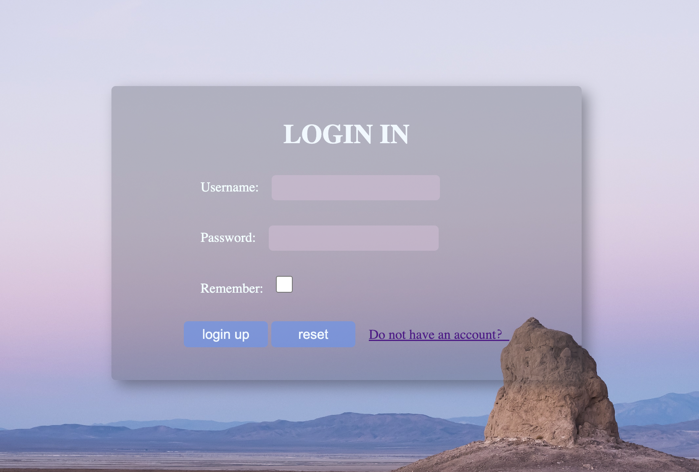
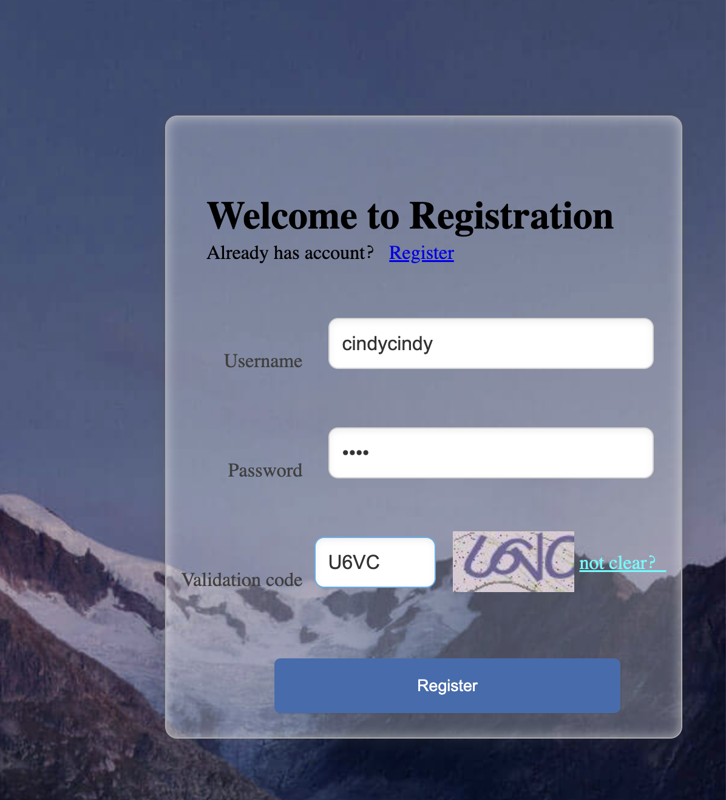
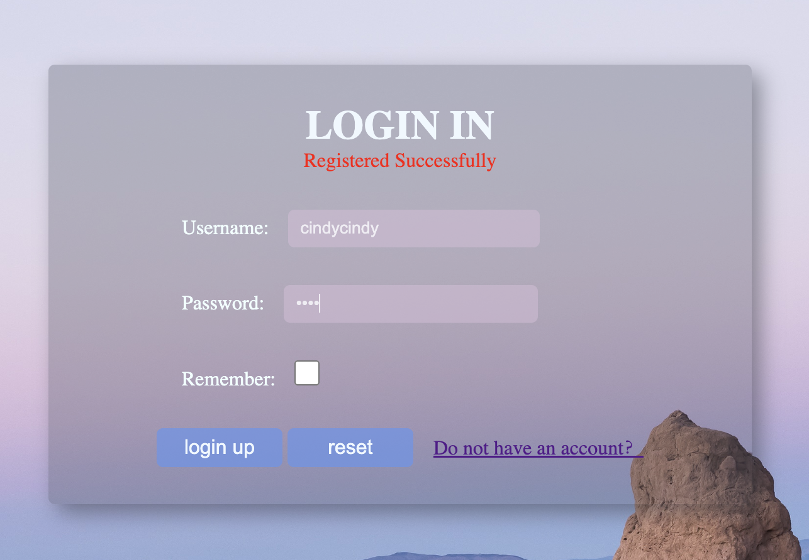
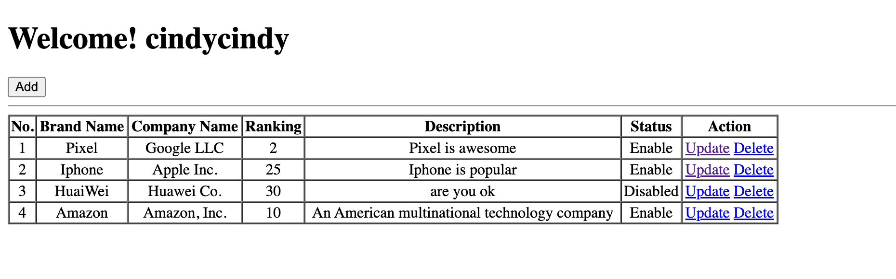

# Brand Demo: Servlet-CRUD-JSP-Session-Cookie
## Quick Start
* mvn tomacat7:run
* http://localhost:6300/brand-demo/login.jsp

## Features
* Login and Logout with corresponding message
* Register new account with checking if it is an existing account
* remember username and password feature
* register validation code with backgroup picture
* Change validation code
* Once login, customized page based on usernmae
* Inquiry all brands
* Add new brand
* Update brand
* Delete brand

###### Login Page

###### Register Page

###### Registered Successfully 

###### Login to the account just registered

